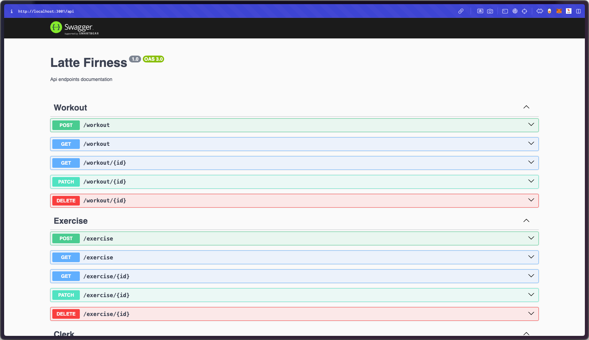
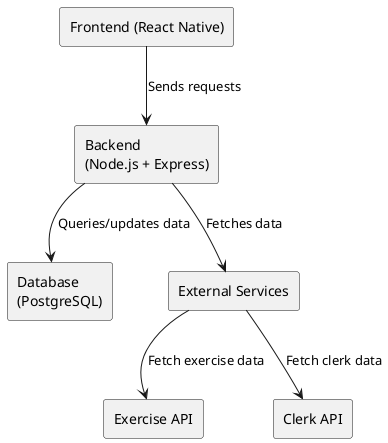

# Fitness App: System Design Document

**Project Name:** Fitness App  
**Release Version:** v1.0 (Initial MVP Release)  
**Date:** November 17, 2024  
**Prepared By:** Team Latte

<div style="page-break-after: always;"></div>

---

## Table of Contents

1. [Introduction](#introduction)
2. [CRC Cards](#crc-cards)
   - User
   - Profile
   - Workout
   - Exercise
   - Meal
   - Food
   - Activity
   - Health
   - ExerciseAPIService
   - AuthenticationService
3. [System Architecture Diagram](#system-architecture-diagram)
4. [API Routes (Workout, Meal & Clerk API)](#api-routes-workout--clerk-api)
5. [System Decomposition](#system-decomposition)
6. [Error Handling and Exception Management](#error-handling-and-exception-management)
7. [Conclusion](#conclusion)

---

<div style="page-break-after: always;"></div>

## 1. Introduction

This document provides an overview of the system design for the Fitness App, detailing the architecture, main classes and their responsibilities, interactions, API routes, and error-handling strategies. The initial design may evolve over time to accommodate new features or improved solutions. Our tech stack includes:

- **Frontend:** React Native (Expo)
- **Backend:** Node.js + Express
- **Database:** PostgreSQL + Prisma
- **External APIs:** Exercise API, Meal API, Clerk API

---

## 2. CRC Cards

### Class: User

- **Responsibilities:**
  - Register and log in users using Clerk.
  - Manage user session information.
  - Retrieve and update user profile information.
- **Collaborations:**
  - **AuthenticationService:** For validating user credentials.
  - **Profile:** For storing and managing user-specific data.

### Class: Profile

- **Responsibilities:**
  - Store user profile data (e.g., name, email).
  - Enable user updates to profile information.
- **Collaborations:**
  - **User:** Owned by a single user, interacts with the User class to link profile data.
  - **Database:** Saves and retrieves profile data in the backend database.
  - **Workout:** Links to the Workout class to manage user workouts.
  - **Health:** Links to the Health class to store health-related information.
  - **Meal:** Links to the Meal class to store meal data.
  - **Activity:** Links to the Activity class to track user activities.

### Class: Workout

- **Responsibilities:**
  - Add, remove, and manage exercises within a workout plan.
  - Save and retrieve workout plans for each user.
- **Collaborations:**
  - **Exercise:** Uses exercises to build a workout plan.
  - **Database:** Interacts with the database for storing and retrieving workout data.
  - **Profile:** Associates with the user's profile.
  - **Activity:** Records activities related to the workout.

### Class: Exercise

- **Responsibilities:**
  - Display and manage exercise information based on muscle groups.
  - Store exercise details (e.g., name, target muscle, equipment).
- **Collaborations:**
  - **ExerciseAPIService:** Fetches exercise information from an external API.
  - **Workout:** Used by the Workout class to add exercises to a workout plan.

### Class: Activity

- **Responsibilities:**
  - Track different user activities (e.g., exercise, meal consumption).
  - Store details about the activity type, description, and associated profile.
- **Collaborations:**
  - **ExerciseAPIService:** Fetches exercise information from an external API.
  - **Workout:** Used by the Workout class to add exercises to a workout plan.
  - **Meal:** Links to meal data to track eating activities.
  - **Profile:** Tracks the user profile associated with the activity.

### Class: ExerciseAPIService

- **Responsibilities:**
  - Connect to external API to fetch exercise data.
  - Cache exercise data in the database to reduce repeated API calls.
- **Collaborations:**
  - **Exercise:** Supplies exercise data to the Exercise class.
  - **Database:** Stores cached exercise data for future access.

### Class: AuthenticationService

- **Responsibilities:**
  - Manage user registration, login, and session validation.
  - Ensure secure handling of authentication using Clerk.
- **Collaborations:**
  - **User:** Verifies and manages user sessions.
  - **Clerk API:** Facilitates authentication with Clerk’s service.

### Class: Meal

- **Responsibilities:**
  - Store meal-related information such as name, description, and nutritional content.
  - Link meals to profiles and activities.
- **Collaborations:**
  - **Profile:** Links to a user's profile for meal data storage.
  - **Food:** Contains food items that make up the meal.
  - **Activity:** Tracks activities related to meal consumption.

### Class: Food

- **Responsibilities:**
  - Store information about food items such as name, quantity, and calories.
- **Collaborations:**
  - **Meal:** A meal can have multiple food items.

### Class: Health

- **Responsibilities:**
  - Store health-related data such as age, height, weight.
  - Enable updates to health data for the user.
- **Collaborations:**
  - **Profile:** A health record is associated with a specific profile.
  - **Activity:** Tracks activities based on health data.

---

## 3. System Architecture Diagram

The Fitness App follows a two-tier architecture (Frontend + Backend). The architecture components are presented in the diagram below.

### Architecture Overview:

- **Frontend (React Native):** Handles UI and user interaction. It sends API requests to the backend and displays the results.
- **Backend (Node.js + Express):** Processes requests from the frontend, communicates with the database, and integrates with external services like Clerk and the Exercise API.
- **Database (PostgreSQL):** Stores user data, workout plans, cached exercise data, meals, food, and activity history.





---

## 4. API Routes (Workout, Meal & Clerk API)

### Workout API Routes:

- **GET /workouts**
  - **Description:** Fetch all workouts for the logged-in user.
  - **Response:** List of all workouts.

- **POST /workouts**
  - **Description:** Create a new workout for the logged-in user.
  - **Request Body:**
  
    ```json
    {  
        "name": "Workout Name",  
        "description": "Workout description",  
        "exercises": [  
            { "exerciseId": 1, "sets": 3, "reps": 12, "weight": 50 }  
        ]  
    }
    ```
  - **Response:** Confirmation of workout creation.

- **PUT /workouts/{id}**
  - **Description:** Update an existing workout.
  - **Request Body:**
  
    ```json
    {  
        "name": "Updated Name",  
        "description": "Updated description"  
    }
    ```
  - **Response:** Confirmation of workout update.

- **DELETE /workouts/{id}**
  - **Description:** Delete a workout by its ID.
  - **Response:** Confirmation of workout deletion.

### Clerk API Routes:

- **POST /register**
  - **Description:** Register a new user via Clerk.
  - **Request Body:**
  
    ```json
    {  
        "email": "user@example.com",  
        "password": "securepassword123"  
    }
    ```
  - **Response:** User registration confirmation.

- **POST /login**
  - **Description:** Login for an existing user.
  - **Request Body:**
  
    ```json
    {  
        "email": "user@example.com",  
        "password": "securepassword123"  
    }
    ```
  - **Response:** Session token for authenticated user.

- **GET /session**
  - **Description:** Check if the user is logged in and fetch session details.
  - **Response:** Session details (user ID, status).

- **POST /logout**
  - **Description:** Log the user out of the app.
  - **Response:** Confirmation of logout.

---

## 5. System Decomposition

### Components and Roles:

- **Frontend:** Manages user interactions and displays data. Sends API requests to the backend and handles responses.
- **Backend:** Handles API requests, business logic, and integrates with external services. Manages authentication, workout creation, and profile management.
- **Database:** Stores all necessary data, including user profiles, workouts, meals, exercise details, and activity history. Provides caching for external API calls to optimize performance.

---

## 6. Error Handling and Exception Management

### Error Categories and Handling Strategy:

- **User Input Errors:**  
  - Handling: Validate inputs on frontend and backend, with user-friendly messages.
  
- **Authentication Errors:**  
  - Handling: Inform users of incorrect logins or expired sessions, redirecting to login as needed.
  
- **Network and API Errors:**  
  - Handling: Inform users of connectivity issues and provide fallback for cached data.
  
- **Database Errors:**  
  - Handling: Retry operations, with fallback to user-friendly error messages.
  
- **Unexpected Errors:**  
  - Handling: Log errors and display a generic error message to the user.

### Anticipated Response Summary:

- **User Input Errors:** “Invalid input. Please check your entries.”
- **Authentication Errors:** “Session expired. Please log in again.”
- **Network and API Errors:** “Network issues detected. Please check your connection.”
- **Database Errors:** “Technical issue encountered. Please try again later.”
- **Unexpected Errors:** “An unexpected error occurred. Please restart the app.”

---
